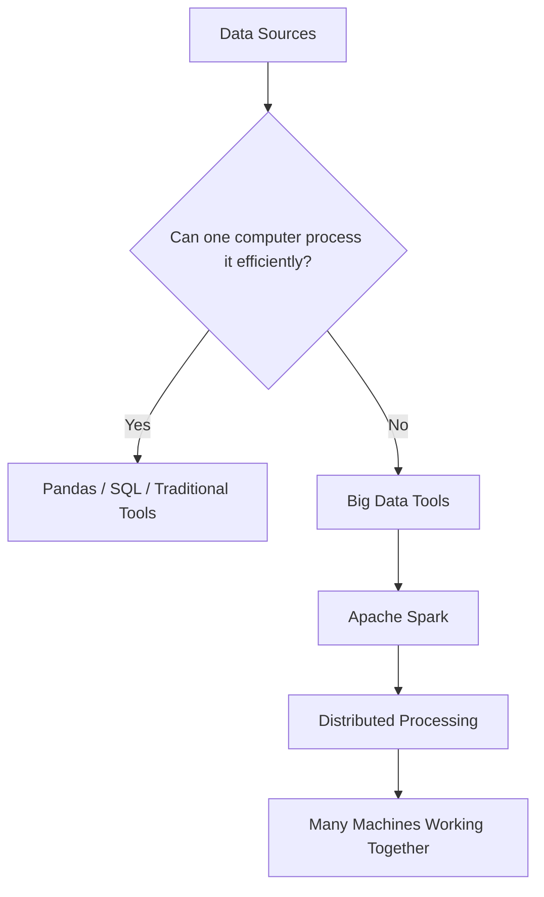
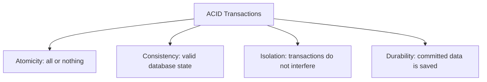
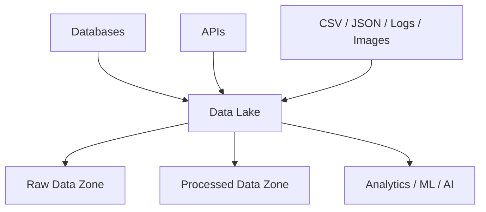
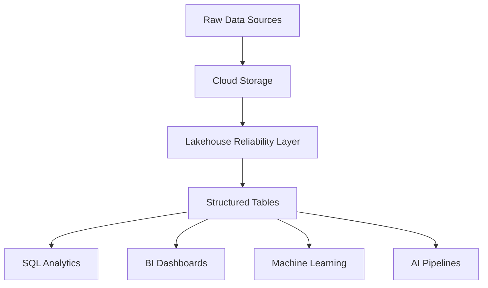
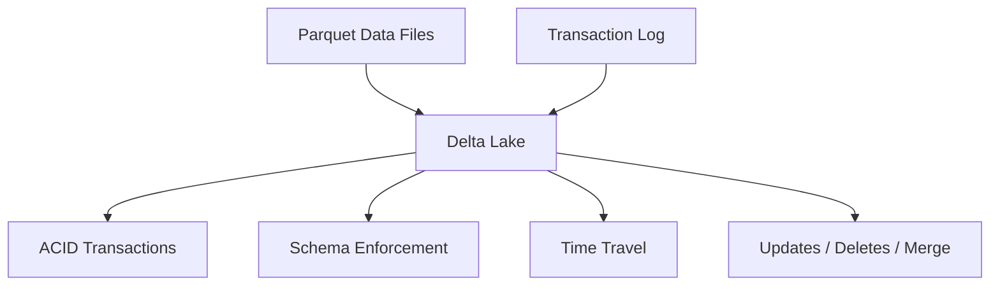
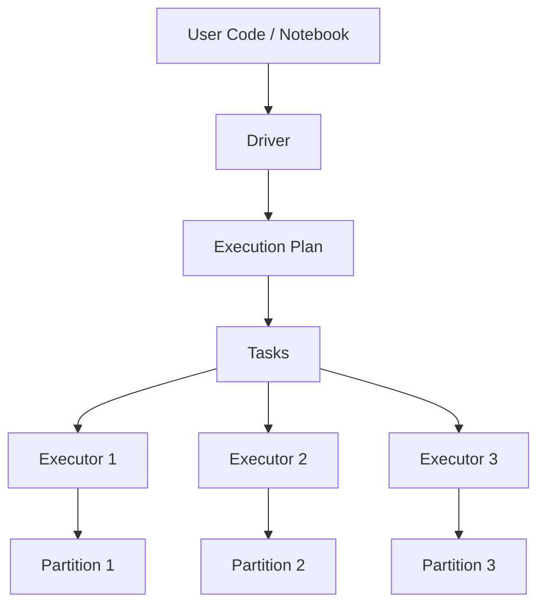
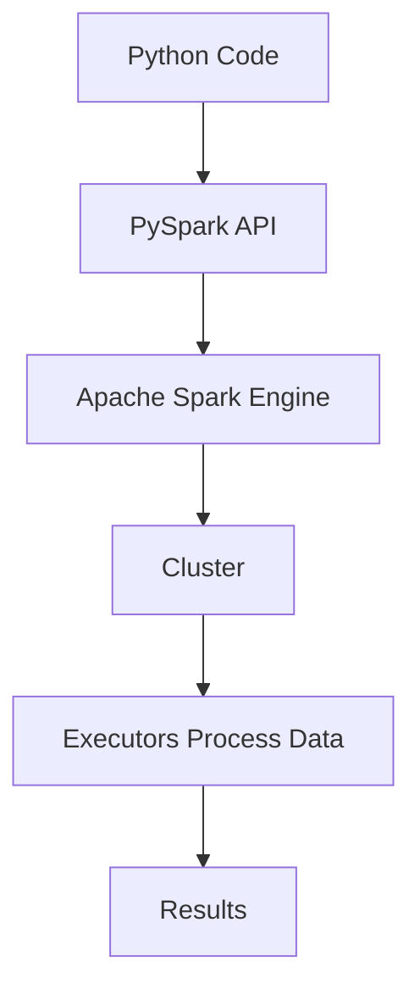
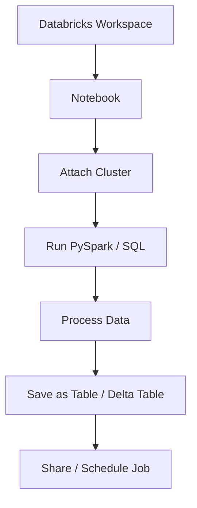
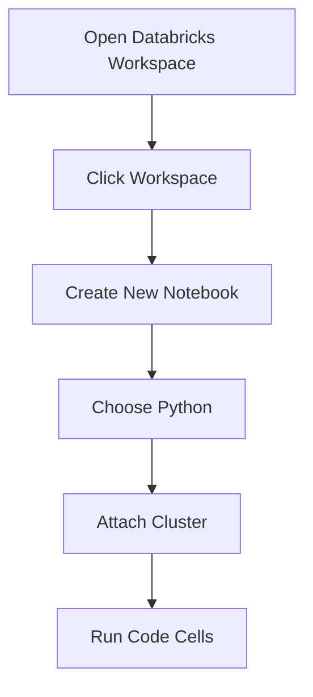
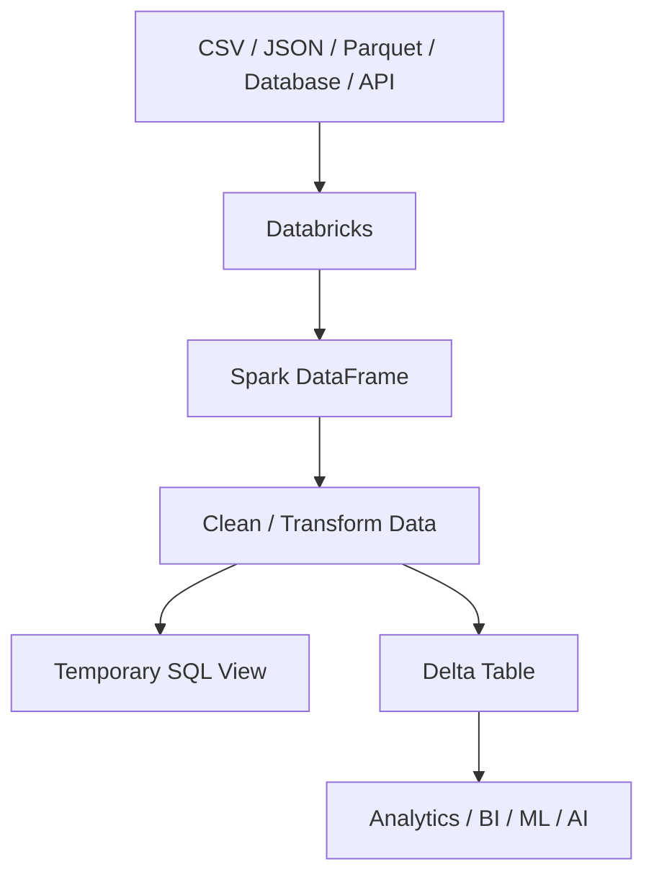

# Databricks and PySpark Research

## 1. What can be considered "Big Data"?

Big Data is data that is too large, too fast, or too complex to be processed efficiently using traditional single-computer tools.

It is not only about file size. Data can be considered Big Data when it creates challenges with:

* Storage
* Processing speed
* Memory limits
* Data variety
* Scalability

Examples of Big Data:

```text
Millions or billions of customer records
Large transaction histories
Website clickstream logs
Sensor data
Healthcare records across many systems
Social media data
Streaming data
```

A normal laptop can process small and medium datasets using tools like Pandas. However, if the dataset is too large to fit into RAM, or processing takes too long, tools such as Apache Spark are needed.



---

## 2. What is OLTP?

OLTP stands for **Online Transaction Processing**.

OLTP systems are used for day-to-day business operations where many small transactions happen quickly.

Examples:

* Online banking
* Online shopping
* Booking systems
* CRM systems
* Inventory systems
* Payment systems

Example:

```text
A customer buys a product online.
The system creates an order, takes payment, updates stock, and confirms the purchase.
```

OLTP systems are designed to be fast, accurate, and reliable.

| Feature    | OLTP                         |
| ---------- | ---------------------------- |
| Purpose    | Run daily transactions       |
| Data       | Current operational data     |
| Query type | Short and simple             |
| Updates    | Very frequent                |
| Example    | Create order, update balance |

---

## 3. What is ACID?

ACID is a set of rules that makes database transactions reliable.

ACID stands for:

```text
Atomicity
Consistency
Isolation
Durability
```

### Atomicity

All parts of a transaction happen, or none happen.

Example:

```text
Money leaves Account A and enters Account B.
The system must not allow only one side of the transfer.
```

### Consistency

The database must remain valid after the transaction.

Example:

```text
A bank account should not break rules such as having an invalid balance.
```

### Isolation

Transactions should not interfere with each other.

Example:

```text
Two people should not be able to book the same final seat at the same time.
```

### Durability

Once a transaction is saved, it should not be lost.

Example:

```text
If payment is confirmed, it should still be saved even if the system restarts.
```



---

## 4. What is OLAP?

OLAP stands for **Online Analytical Processing**.

OLAP systems are used for analysis, reporting, dashboards, and decision-making.

Examples:

* Sales reports
* Power BI dashboards
* NHS activity reporting
* Forecasting
* Customer behaviour analysis
* Performance monitoring

OLAP is not mainly about changing individual records. It is about analysing large amounts of data.

Example SQL query:

```sql
SELECT region,
       SUM(revenue) AS total_revenue
FROM sales
GROUP BY region;
```

| Feature    | OLAP                       |
| ---------- | -------------------------- |
| Purpose    | Analyse data               |
| Data       | Historical and aggregated  |
| Query type | Complex analytical queries |
| Updates    | Less frequent              |
| Example    | Total revenue by region    |

---

## 5. OLTP vs OLAP

| Feature      | OLTP                               | OLAP                         |
| ------------ | ---------------------------------- | ---------------------------- |
| Main purpose | Transactions                       | Analytics                    |
| Example      | Customer places order              | Analyst reviews sales trends |
| Data         | Current                            | Historical                   |
| Query type   | Short and simple                   | Large and complex            |
| Users        | Applications and operational teams | Analysts and managers        |
| Priority     | Speed and accuracy                 | Insights and reporting       |

---

## 6. What are Data Lakes? How do they work?

A Data Lake is a central storage area that stores raw data in its original format.

A Data Lake can store:

```text
CSV files
JSON files
Parquet files
Log files
Images
Audio
Video
API extracts
Database exports
```

Data Lakes are useful because they allow organisations to store large amounts of data before deciding exactly how to use it.

This is called:

```text
Schema-on-read
```

It means the structure is applied when the data is read and analysed, not necessarily when it is stored.

### How Data Lakes work

```text
Data Sources
     ↓
Raw Data Storage
     ↓
Processing Layer
     ↓
Analytics / Machine Learning / Reporting
```

Example:

```text
CRM system + website logs + CSV files + APIs
                  ↓
              Data Lake
                  ↓
         Spark / Databricks / SQL
```

Benefits:

* Stores large volumes of data
* Supports many data formats
* Good for machine learning and AI
* Usually cheaper than traditional warehouses
* Useful for raw and historical data

Challenge:

If badly managed, a Data Lake can become a **Data Swamp**, where data is hard to find, poorly documented, duplicated, or unreliable.



---

## 7. What are Data Lakehouses? How do they work?

A Data Lakehouse combines the flexibility of a Data Lake with the reliability and performance of a Data Warehouse.

In simple terms:

```text
Data Lakehouse = Data Lake + Data Warehouse features
```

A Lakehouse can support:

* Raw data storage
* Cleaned structured data
* SQL analytics
* BI dashboards
* Machine learning
* AI pipelines
* Data governance
* Reliable transactions

### Why Lakehouses were created

Before Lakehouses, many organisations had separate systems:

```text
Data Lake → Data Warehouse → BI Reports
```

This created problems:

* Duplicate data
* More complex pipelines
* Higher costs
* More governance challenges
* Slower movement from raw data to insight

A Lakehouse reduces this complexity by allowing teams to use one platform for storage, analytics, machine learning, and AI.

### How Lakehouses work

```text
Raw data is stored in cloud storage.
A reliability layer is added on top.
Users can query the data using SQL, Spark, BI tools, or ML tools.
```



---

## 8. What are Delta Lakes?

Delta Lake is a storage layer that makes Data Lakes more reliable.

A simple explanation:

```text
Delta Lake = Parquet files + transaction log + reliability features
```

Delta Lake is commonly used with Apache Spark and Databricks.

It solves common Data Lake problems such as:

* Data corruption
* Failed writes
* No transaction history
* Difficult updates and deletes
* Weak schema control
* Poor reliability

Key Delta Lake features:

### ACID transactions

Data writes are reliable and consistent.

### Schema enforcement

Bad or unexpected data can be rejected.

### Time travel

Users can query older versions of a table.

Example:

```sql
SELECT *
FROM sales VERSION AS OF 5;
```

### Updates and deletes

Delta Lake supports operations such as:

```sql
UPDATE
DELETE
MERGE
```

### Better performance

Delta Lake can improve query performance through optimisation and metadata handling.



---

## 9. What is Apache Spark?

Apache Spark is an open-source distributed data processing framework.

It is used to process large datasets across many computers.

Simple comparison:

```text
Pandas = one machine
Spark = many machines
```

Spark can:

* Read data
* Clean data
* Filter data
* Join tables
* Aggregate data
* Run SQL
* Process streaming data
* Support machine learning
* Build data pipelines

---

## 10. What problem did Apache Spark solve?

Before Spark, large-scale data processing often used tools such as Hadoop MapReduce.

MapReduce was powerful, but it had limitations:

* It could be slow.
* It wrote many intermediate results to disk.
* It was harder to use.
* It was less suitable for interactive analysis.
* It was less convenient for machine learning workflows.

Spark solved these problems by providing faster, more flexible distributed processing.

One important advantage of Spark is that it can keep data in memory between processing steps when appropriate. This makes many workloads faster.

---

## 11. How does Spark work? What is the architecture behind the scenes?

Spark works by splitting data and processing across multiple machines.

The main architecture components are:

```text
Driver
Executors
Cluster
Partitions
Tasks
```

### Driver

The Driver controls the Spark application.

It plans the work and coordinates execution.

```text
Driver = manager
```

### Executors

Executors are worker processes.

They do the actual calculations.

```text
Executors = workers
```

### Cluster

A cluster is a group of computers working together.

```text
Cluster = team of machines
```

### Partitions

A partition is a chunk of data.

Spark splits large datasets into partitions so they can be processed in parallel.

### Tasks

A task is a unit of work sent to an Executor.

### Spark architecture

```text
User Code / Notebook
        ↓
      Driver
        ↓
  Execution Plan
        ↓
     Executors
        ↓
    Data Partitions
```


---

## 12. Why did Spark become popular?

Spark became popular because it is:

* Fast
* Scalable
* Easier to use than older Big Data tools
* Suitable for batch processing
* Suitable for streaming
* Compatible with SQL
* Compatible with Python through PySpark
* Useful for data engineering
* Useful for machine learning
* Suitable for cloud platforms

Spark is widely used because it supports multiple workloads in one framework.

---

## 13. What is PySpark? Why do we tend to use it?

PySpark is the Python API for Apache Spark.

It allows developers to use Spark with Python.

Simple explanation:

```text
Apache Spark = processing engine
PySpark = Python way to use Spark
```

We tend to use PySpark because Python is widely used by:

* Data analysts
* Data engineers
* Data scientists
* Machine learning engineers
* AI engineers

Many people already know Python, Pandas, and SQL. PySpark allows them to process large-scale data without needing to learn Scala first.

Example PySpark code:

```python
df = spark.read.csv(
    "sales.csv",
    header=True,
    inferSchema=True
)

df.show()
```



---

## 14. What is Databricks?

Databricks is a cloud-based data and AI platform built around Apache Spark.

It provides a managed environment for:

* Data engineering
* Data analytics
* Machine learning
* AI workflows
* SQL analytics
* Data governance
* Collaboration

Simple analogy:

```text
Spark = car engine
Databricks = entire car
```

Spark is the processing engine.

Databricks provides the platform around it.

---

## 15. What problems did Databricks solve?

Using Spark directly can be complex.

Without Databricks, organisations may need to manage:

```text
Servers
Clusters
Spark installation
Storage
Networking
Security
Permissions
Scheduling
Monitoring
Collaboration
```

Databricks simplifies this by providing a managed platform.

This allows teams to focus on:

* Loading data
* Cleaning data
* Analysing data
* Building pipelines
* Building machine learning models
* Creating AI workflows

---

## 16. How does Databricks work?

A typical Databricks workflow is:

```text
Open Databricks Workspace
        ↓
Create Notebook
        ↓
Attach Cluster
        ↓
Load Data
        ↓
Run Spark / SQL Code
        ↓
Save Results
        ↓
Share or Schedule Workflow
```

The notebook contains the code.

The cluster provides the computing power.

Spark processes the data.

Results can be saved as files, tables, or Delta tables.



---

## 17. Why has Databricks become popular?

Databricks has become popular because it combines many important data tools in one platform.

It supports:

* Big Data processing
* Apache Spark
* PySpark
* SQL analytics
* Delta Lake
* Data Lakehouse architecture
* Machine learning
* AI pipelines
* Collaboration
* Governance
* Scalable cloud computing

It is useful for data engineers, analysts, data scientists, and AI teams.

---

## 18. What are Databricks' key features?

Key Databricks features include:

### Workspace

The main working environment where users manage notebooks, files, clusters, jobs, and projects.

### Notebooks

Interactive documents where users write and run Python, SQL, Scala, R, and Markdown.

### Clusters

Cloud computing resources that run Spark code.

### Jobs

Scheduled or automated workflows.

### Databricks SQL

A SQL interface for querying data and building dashboards.

### Delta Lake

Reliable storage layer for Lakehouse tables.

### MLflow

Tool for managing machine learning experiments and models.

### Unity Catalog

Governance layer for permissions, metadata, access control, and lineage.

### Collaboration

Teams can work together in shared notebooks and workspaces.

---

## 19. Where to sign up for Databricks

For learning, use Databricks Free Edition:

```text
https://www.databricks.com/learn/free-edition
```

Main Databricks website:

```text
https://www.databricks.com/
```

Databricks documentation:

```text
https://docs.databricks.com/
```

General signup steps:

1. Go to the Databricks Free Edition page.
2. Create an account.
3. Verify your email.
4. Launch the workspace.
5. Create a notebook.
6. Start using sample data or upload your own data.

---

## 20. How to create a notebook in Databricks

Steps:

1. Open Databricks workspace.
2. Go to the left-hand navigation menu.
3. Click **Workspace**.
4. Select a folder.
5. Click **Create** or **New**.
6. Select **Notebook**.
7. Give the notebook a name.
8. Choose the default language, for example Python.
9. Attach the notebook to a cluster.
10. Start writing and running code.

Example first cell:

```python
print("Hello Databricks")
```

Example Spark cell:

```python
df = spark.range(10)

df.show()
```

Expected output:

```text
+---+
| id|
+---+
|  0|
|  1|
|  2|
|  3|
|  4|
|  5|
|  6|
|  7|
|  8|
|  9|
+---+
```



---

## 21. How to ingest data in Databricks

Data ingestion means bringing data into Databricks so it can be processed.

Common data sources include:

* CSV files
* JSON files
* Parquet files
* Databases
* APIs
* Cloud storage
* Streaming data

Example: ingest CSV data using PySpark.

```python
df = spark.read.csv(
    "/FileStore/data/sales.csv",
    header=True,
    inferSchema=True
)

df.show()
```

Check schema:

```python
df.printSchema()
```

Select columns:

```python
df.select(
    "country",
    "revenue"
).show()
```

Filter rows:

```python
df.filter(
    df.revenue > 1000
).show()
```

Group and aggregate:

```python
df.groupBy(
    "country"
).sum(
    "revenue"
).show()
```

Create a temporary SQL view:

```python
df.createOrReplaceTempView("sales")
```

Run SQL:

```python
spark.sql("""
SELECT country,
       SUM(revenue) AS total_revenue
FROM sales
GROUP BY country
ORDER BY total_revenue DESC
""").show()
```

Save as a Delta table:

```python
df.write.format("delta").mode("overwrite").saveAsTable(
    "sales_delta"
)
```

Read the Delta table:

```python
sales_delta_df = spark.read.table("sales_delta")

sales_delta_df.show()
```



---

## 22. Short Summary

Big Data refers to data that is too large, fast, varied, or complex for traditional tools to process efficiently. OLTP systems process daily transactions and rely on ACID principles for reliability. OLAP systems are used for analytics and reporting. Data Lakes store raw data at scale, while Data Lakehouses combine Data Lake flexibility with Data Warehouse reliability. Delta Lake adds reliability, transactions, schema control, and time travel to Data Lakes.

Apache Spark is a distributed processing framework that processes large datasets across clusters. PySpark allows Python users to work with Spark. Databricks is a cloud platform built around Spark that provides notebooks, clusters, Delta Lake, SQL analytics, machine learning tools, governance, and collaboration features.
