# LLMs and Data Research

This document explains the core concepts behind Large Language Models (LLMs), tokens, context windows, hallucinations, retrieval, RAG, embeddings, vectors, vector databases, and semantic similarity.

It is written for a data engineering / data science learning context where LLMs may be used together with MongoDB, PySpark, AI enrichment, and vector databases.

---

## 1. What are LLMs?

**LLM** stands for **Large Language Model**.

A Large Language Model is a machine learning model trained on very large amounts of text and other data so that it can generate, transform, classify, summarise, translate, and reason over language-like inputs.

Google Cloud defines an LLM as a statistical language model trained on a massive amount of data that can generate and translate text and perform other natural language processing tasks. AWS describes LLMs as very large deep learning models pre-trained on vast amounts of data and usually based on transformer architectures.

In simple terms:

> An LLM is a model that has learned statistical patterns in language and uses those patterns to predict likely outputs from a given input.

Examples of things LLMs can do:

- answer questions
- summarise long documents
- classify text
- translate languages
- generate code
- explain concepts
- extract structured data from text
- rewrite text in a different style
- support chatbots and AI assistants

### Simple diagram

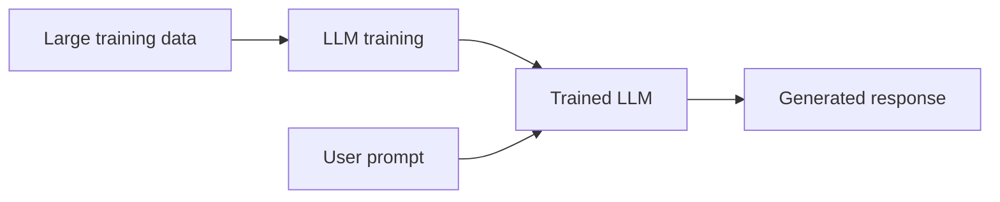

---

## 2. Are LLMs just a big database?

No. **LLMs are not just big databases.**

A traditional database stores information explicitly. For example, a database might store:

| Customer ID | Name | City |
|---|---|---|
| 101 | Amina Khan | London |

You can query it directly:

```sql
SELECT city
FROM customers
WHERE customer_id = 101;
```

The database retrieves a stored value.

An LLM works differently. It does not usually retrieve exact records from its training data. Instead, it has learned statistical relationships between words, phrases, facts, code patterns, and concepts.

A better comparison:

| System | What it stores | How it answers |
|---|---|---|
| Database | Explicit records | Retrieves matching records |
| LLM | Learned statistical patterns in model weights | Predicts likely next tokens |
| Search engine | Indexed documents | Retrieves web pages/documents |
| RAG system | LLM + external search/retrieval | Retrieves documents, then generates an answer |

So an LLM may know that "Paris is the capital of France" because that pattern appears strongly in training data, but it is not looking up a row in a table called `capitals`.

### Database vs LLM

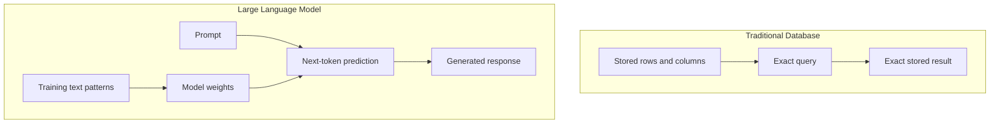

---

## 3. Examples of different LLMs

Different companies and research organisations produce different LLMs.

Examples include:

| Model family | Organisation | Notes |
|---|---|---|
| GPT models | OpenAI | Used in ChatGPT and OpenAI API products |
| Claude | Anthropic | Known for long-context and safety-focused design |
| Gemini | Google DeepMind | Multimodal model family used in Google AI products |
| Llama | Meta | Open-weight model family often used by developers and researchers |
| Mistral / Mixtral | Mistral AI | Popular European open / commercial model family |
| Command | Cohere | Often used for enterprise NLP and retrieval workflows |

Some LLMs are **closed/commercial**; others are **open-weight**, meaning developers can download model weights and run or fine-tune them themselves.

---

## 4. What can you give LLMs for their training?

LLMs can be trained on many forms of data, depending on the model type.

For text-based LLMs, training data can include:

- books
- websites
- articles
- documentation
- code repositories
- academic papers
- forums
- question-answer datasets
- multilingual text
- instruction-following datasets
- human feedback examples

For multimodal models, training data may also include:

- images
- audio
- video
- diagrams
- tables
- screenshots
- documents containing text and images

Important: training data must be handled carefully because it may contain:

- copyright restrictions
- personal data
- bias
- misinformation
- outdated information
- private or sensitive data

In real business projects, you normally do **not** train a new LLM from scratch. That is extremely expensive. Instead, you usually use:

1. **Prompting** — give instructions at runtime.
2. **RAG** — retrieve external data and pass it into the prompt.
3. **Fine-tuning** — adapt a model using task-specific examples.
4. **Embeddings** — represent text as vectors for search, clustering, classification, or recommendation.

---

## 5. What, at a base level, are LLMs trying to do?

At a base level, most language models are trained to do this:

> Predict the next token in a sequence.

A token can be a word, part of a word, punctuation mark, number, or symbol.

Example:

```text
The capital of France is ___
```

A well-trained model predicts:

```text
Paris
```

Another example:

```text
SELECT * FROM customers WHERE country = ___
```

A model may predict:

```text
'UK'
```

The model is not consciously understanding the world. It is calculating likely continuations based on patterns it learned during training.

### Next-token prediction

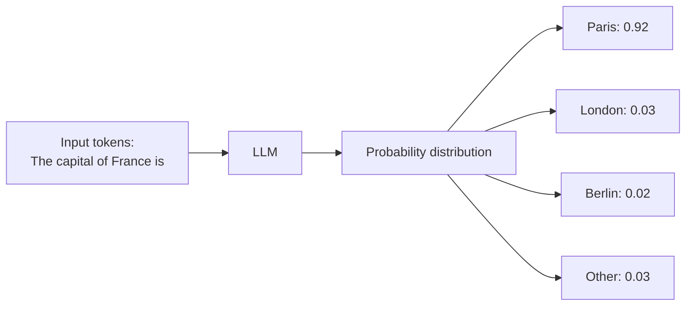

---

## 6. Prediction, not understanding

The phrase **"prediction, not understanding"** means that LLMs generate answers by predicting likely text, not by truly understanding facts in the human sense.

Humans connect language to lived experience, memory, perception, goals, emotions, and the physical world.

LLMs process tokens mathematically. They identify patterns such as:

- words that often appear together
- question-answer structures
- code syntax patterns
- common explanations
- factual associations
- style and tone patterns

This can produce very useful answers, but it also creates risk.

For example, if asked:

```text
Give me the source for a made-up research paper called "Deep Learning in Ancient Rome".
```

An LLM may invent a plausible-looking citation because academic references have a recognisable pattern:

```text
Author, year, title, journal, volume, issue, pages.
```

The output may look correct, but the paper may not exist.

So:

| Human understanding | LLM prediction |
|---|---|
| grounded in lived experience and external reality | grounded in training patterns and prompt context |
| can verify using senses/tools | needs external tools/retrieval to verify |
| can know when it personally does not know | may still generate a confident continuation |

---

## 7. Examples of asking an LLM for a prediction and getting an accurate answer

In LLMs, "prediction" does not only mean forecasting the future. It often means predicting the most likely label, word, category, continuation, or transformation.

Below are examples where an LLM can usually make an accurate prediction because the pattern is clear.

### Example 1: Predict the next word

Prompt:

```text
Complete the sentence: The capital of France is ___
```

Accurate answer:

```text
Paris
```

Why accurate?

Because this fact appears frequently and consistently in training data.

---

### Example 2: Predict sentiment

Prompt:

```text
Classify the sentiment: "The delivery was late and the food was cold."
```

Accurate answer:

```text
Negative
```

Why accurate?

Words like "late" and "cold" in a customer review context strongly indicate dissatisfaction.

---

### Example 3: Predict language

Prompt:

```text
What language is this sentence written in: "Je voudrais un café, s'il vous plaît"?
```

Accurate answer:

```text
French
```

Why accurate?

The phrase contains common French words and grammar.

---

### Example 4: Predict intent

Prompt:

```text
Classify the user intent: "I forgot my password and cannot log in."
```

Accurate answer:

```text
Password reset / account access support
```

Why accurate?

The phrase matches common customer support intent patterns.

---

### Example 5: Predict a SQL query pattern

Prompt:

```text
Write a SQL query to count orders per customer from a table called orders with columns customer_id and order_id.
```

Accurate answer:

```sql
SELECT customer_id, COUNT(order_id) AS order_count
FROM orders
GROUP BY customer_id;
```

Why accurate?

This is a common SQL aggregation pattern.

---

### Example 6: Predict category from text

Prompt:

```text
Classify this NHS patient comment into a theme: "I waited six weeks for an appointment and nobody explained the delay."
```

Accurate answer:

```text
Access / waiting time / communication
```

Why accurate?

The comment contains clear indicators of waiting time and communication issues.

---

### Bonus note on using more than one LLM

Different LLMs such as GPT, Claude, Gemini, Llama, and Mistral would usually answer the simple examples above similarly because they are high-confidence language patterns. Differences are more likely when the task is ambiguous, specialised, recent, or requires exact source verification.

---

## 8. What are tokens?

A **token** is a unit of text that an LLM processes.

A token may be:

- a whole word
- part of a word
- punctuation
- a number
- a symbol
- whitespace or formatting marker

Example sentence:

```text
I love data science.
```

Possible tokenisation:

```text
[I] [love] [data] [science] [.]
```

But another word may be split:

```text
unbelievable
```

Possible tokenisation:

```text
[un] [believ] [able]
```

The exact split depends on the tokenizer used by the model.

---

## 9. What is tokenisation?

**Tokenisation** is the process of breaking text into tokens before the model processes it.

LLMs do not directly read text as humans do. They convert text into token IDs.

Example:

```text
Data is powerful.
```

May become:

```text
[Data] [is] [powerful] [.]
```

Then each token is converted into a numerical ID:

```text
[8432, 374, 8147, 13]
```

The model processes the numbers, not the raw text.

### Tokenisation flow

```mermaid
flowchart LR
    A[Raw text:<br/>Data is powerful.] --> B[Tokenizer]
    B --> C[Tokens:<br/>Data | is | powerful | .]
    C --> D[Token IDs:<br/>8432 | 374 | 8147 | 13]
    D --> E[LLM input]
```

---

## 10. Why do tokens matter?

Tokens matter because they affect:

1. **Cost**  
   Many AI APIs charge based on input and output tokens.

2. **Context window size**  
   The model can only process a limited number of tokens at once.

3. **Speed**  
   More tokens usually means slower processing.

4. **Memory within the conversation**  
   If a conversation becomes too long, older content may be compressed, summarised, or removed from the active context.

5. **Embedding limits**  
   Embedding models also have maximum input token limits.

OpenAI's embedding documentation states that embeddings are billed based on input tokens and that embedding models have maximum input token limits.

---

## 11. What is the context window?

The **context window** is the maximum amount of text, measured in tokens, that an LLM can consider at one time.

It includes:

- your prompt
- previous conversation messages
- system instructions
- retrieved documents
- uploaded text
- tool outputs
- the model's generated response

If the context window is too small for the full conversation or document, the model cannot use everything at once.

Example:

```text
Model context window = 8,000 tokens
Your document = 20,000 tokens
```

The full document cannot fit into the model at once.

### Context window diagram

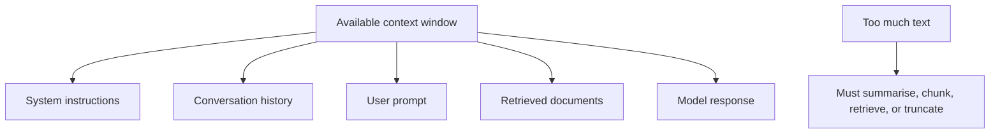

---

## 12. Ways to mitigate or get around context windows

Common methods:

### 1. Chunking

Break long documents into smaller sections.

Example:

```text
100-page report → chunks of 500 words
```

---

### 2. Summarisation

Summarise older or less important content.

Example:

```text
Full meeting transcript → key decisions and actions
```

---

### 3. Retrieval-Augmented Generation (RAG)

Store documents externally and retrieve only the most relevant chunks at question time.

---

### 4. Vector search

Convert chunks into embeddings and search by semantic similarity.

---

### 5. Sliding window

Keep only the most recent or most relevant conversation sections.

---

### 6. Hierarchical summarisation

Summarise chunks, then summarise the summaries.

---

### 7. Use models with larger context windows

Some newer models support very large context windows, but larger context is still not the same as perfect memory. It can be more expensive and may still struggle with exact retrieval from very long input.

### Mitigation diagram

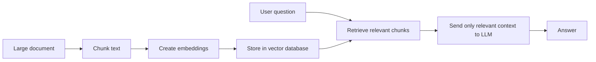

---

## 13. What are hallucinations and why do they happen?

An **AI hallucination** is when an LLM produces information that sounds confident but is false, unsupported, fabricated, or unverifiable.

Examples:

- fake citations
- invented laws
- non-existent Python packages
- incorrect dates
- fake company policies
- wrong medical or legal information
- fabricated statistics

Hallucinations happen because LLMs are optimised to generate likely text, not to guarantee truth.

Main causes:

1. **Prediction objective**  
   The model predicts likely tokens. Likely text is not always true text.

2. **Missing information**  
   If the answer is not in the training data or prompt, the model may still generate a plausible answer.

3. **Outdated training data**  
   The model may not know recent events unless connected to retrieval or search.

4. **Ambiguous prompts**  
   If the question is unclear, the model may fill gaps with assumptions.

5. **No source grounding**  
   Without retrieved evidence, the model may rely on internal patterns only.

6. **Training incentives**  
   Some evaluation setups reward complete answers more than uncertainty, which can encourage guessing.

IBM explains that hallucination occurs when models present incorrect or made-up information as factual and that RAG can reduce, but not eliminate, this risk.

### Hallucination flow

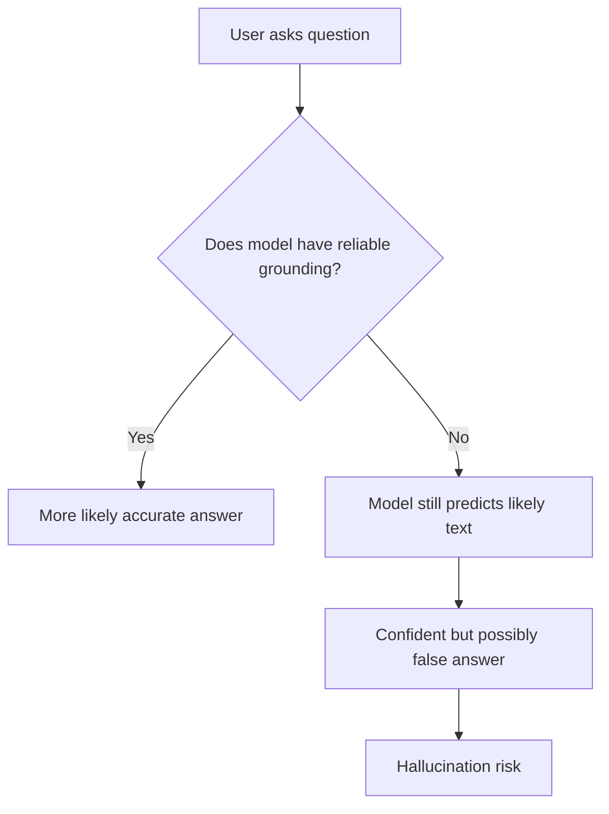

---

## 14. Training vs Retrieval

Training and retrieval are different ways of giving information to an AI system.

### Training

Training changes the model itself.

The model learns patterns from large datasets, and those patterns are stored in its parameters/weights.

Training is expensive and slow for large models.

### Retrieval

Retrieval does not change the model.

Instead, the system searches external data at the time of the question and passes relevant information into the prompt.

This is the basis of RAG.

| Concept | Training | Retrieval |
|---|---|---|
| Changes model weights? | Yes | No |
| Expensive? | Usually very expensive | Usually cheaper |
| Good for | General model capability | Current/private/domain-specific facts |
| Example | Train model on language/code | Search company policy docs at runtime |
| Updates | Requires retraining/fine-tuning | Update the external database |

### Training vs retrieval diagram

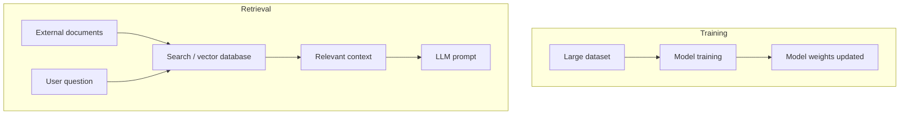

---

## 15. Why does external data matter so much?

External data matters because an LLM's training data may be:

- outdated
- incomplete
- too general
- missing private company data
- missing local project data
- missing recent policy changes
- missing specialist domain knowledge

Example:

A general LLM may know what the NHS is, but it will not automatically know:

- your latest project dataset
- your organisation's internal policy
- yesterday's operational figures
- a private MongoDB collection
- a new PDF report uploaded today
- a local business rule

External data allows the LLM to answer using specific, current, and relevant information.

This is especially important for:

- healthcare
- finance
- legal work
- government services
- internal business reporting
- data pipelines
- customer support
- compliance-heavy environments

---

## 16. What is RAG?

**RAG** stands for **Retrieval-Augmented Generation**.

It is an architecture where the system retrieves relevant information from an external source and gives it to the LLM before the LLM generates an answer.

IBM describes RAG as an architecture that connects generative AI models with external knowledge bases so they can produce more relevant and higher-quality responses.

In simple terms:

> RAG = Search first, then generate.

Without RAG:

```text
User question → LLM → Answer based only on model training + prompt
```

With RAG:

```text
User question → Search external knowledge → Add relevant context → LLM → Grounded answer
```

---

## 17. Basic flow of an LLM prompt response with RAG

### RAG flow

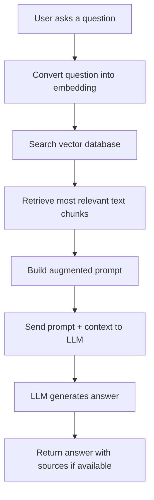

### Example

User asks:

```text
What are the main complaints about GP access in this dataset?
```

RAG system:

1. Converts the question into an embedding.
2. Searches complaint/comment embeddings in a vector database.
3. Retrieves the most relevant comments.
4. Sends those comments to the LLM.
5. LLM summarises the themes.
6. Output may include themes such as waiting times, appointment availability, phone access, and communication.

---

# Bonus Topics

---

## 18. What is semantic similarity?

**Semantic similarity** means similarity of meaning, not just similarity of words.

Example:

```text
hospital waiting list
```

is semantically similar to:

```text
elective care backlog
```

Even though the exact words are different.

Another example:

```text
reset my password
```

is semantically similar to:

```text
I cannot access my account
```

Semantic similarity allows AI systems to find related content even when the wording is different.

---

## 19. Why is semantic similarity not a thing in traditional databases and traditional querying?

Traditional databases are designed for exact, structured queries.

Example SQL query:

```sql
SELECT *
FROM documents
WHERE text LIKE '%hospital waiting list%';
```

This searches for exact words or patterns.

It may miss documents saying:

```text
elective care backlog
```

because the words are different.

Traditional databases are excellent for:

- exact IDs
- dates
- categories
- numeric filters
- joins
- aggregations
- transactions

But they do not naturally understand meaning.

Semantic search requires text to be converted into embeddings and compared in vector space.

### Traditional search vs semantic search

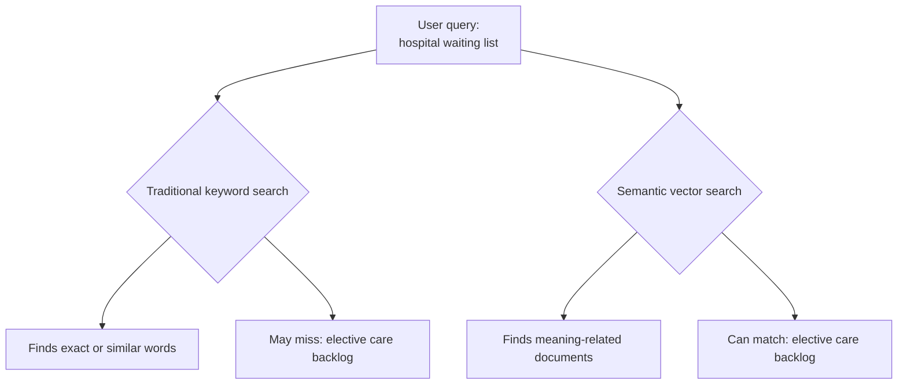

---

## 20. What are embeddings?

An **embedding** is a numerical representation of meaning.

OpenAI describes embeddings as vectors, or lists of floating point numbers, where the distance between vectors measures relatedness. Small distances suggest high relatedness; large distances suggest low relatedness.

Example:

```text
doctor
```

could become:

```text
[0.12, -0.45, 0.88, 0.03]
```

The real vector may have hundreds or thousands of numbers.

Embeddings are commonly used for:

- semantic search
- clustering
- recommendations
- classification
- anomaly detection
- RAG
- duplicate detection
- topic analysis

---

## 21. Why are embeddings important in AI systems?

Embeddings are important because they let AI systems compare meaning mathematically.

For example:

```text
GP appointment delay
```

and:

```text
I could not see a doctor for weeks
```

do not share many exact words, but they are related in meaning.

Embeddings allow the system to identify that relationship.

Without embeddings, RAG systems would rely mainly on keyword search.

With embeddings, RAG systems can retrieve information based on meaning.

---

## 22. What are vectors?

A **vector** is a list of numbers.

In AI, vectors often represent text, images, users, products, or documents.

Simple 2D vector:

```text
[2, 3]
```

This means:

- x = 2
- y = 3

Text embedding vector:

```text
[0.12, -0.45, 0.88, 0.03, ...]
```

Each number captures some learned feature of the text.

The individual numbers are usually not directly interpretable by humans. The useful part is how vectors relate to each other.

---

## 23. Example of vectors

Imagine we simplify meaning into only two dimensions:

- x-axis = healthcare meaning
- y-axis = finance meaning

This is oversimplified, but useful for learning.

| Text | Example vector |
|---|---|
| doctor | [0.9, 0.1] |
| nurse | [0.85, 0.12] |
| hospital | [0.95, 0.08] |
| bank loan | [0.1, 0.9] |
| mortgage | [0.12, 0.85] |

Healthcare words are close together. Finance words are close together. Healthcare and finance words are far apart.

### Simple vector space

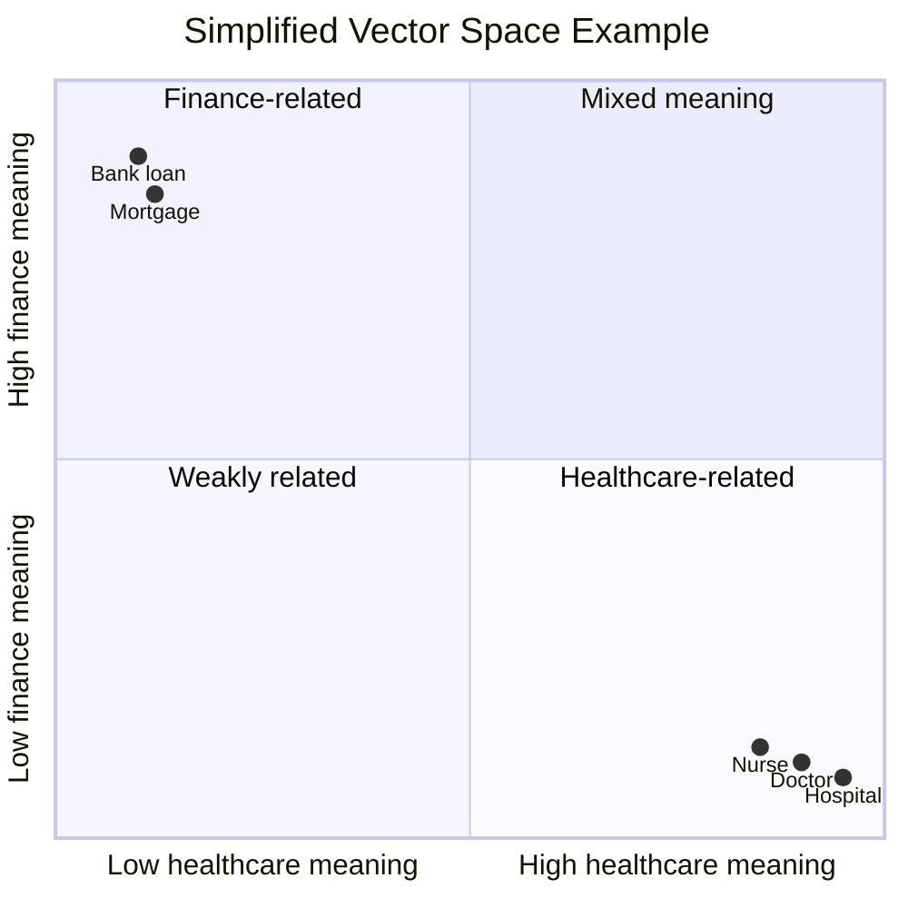

---

## 24. What is vector space?

**Vector space** is the mathematical space where vectors live.

For simple learning, we can imagine 2D or 3D space.

But real embeddings often have many more dimensions, such as:

- 384
- 768
- 1,536
- 3,072

In vector space:

- similar meanings are close together
- different meanings are far apart
- distance or angle can be used to measure similarity

Example:

```text
"doctor" and "nurse" → close
"doctor" and "banana" → far apart
```

---

## 25. What is cosine similarity?

**Cosine similarity** measures how similar two vectors are by comparing the angle between them.

It is widely used in vector search.

MongoDB Atlas Vector Search supports similarity functions including cosine, Euclidean, and dot product. MongoDB explains that cosine measures similarity based on the angle between vectors.

Simple interpretation:

| Cosine similarity | Meaning |
|---|---|
| 1.0 | Very similar / same direction |
| 0.0 | Not related / perpendicular |
| -1.0 | Opposite direction |

Cosine similarity focuses on direction rather than size.

### Cosine similarity visual

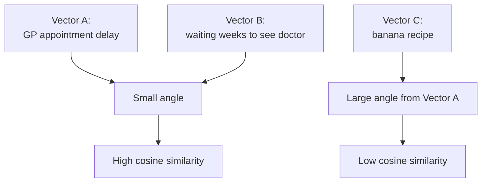

---

## 26. How these concepts connect in a real AI data pipeline

A realistic data pipeline may look like this:


Example use case:

NHS patient comments:

```text
"I waited three weeks for an appointment and nobody called me back."
```

AI enrichment output:

```json
{
  "theme": "Access to appointments",
  "sentiment": "Negative",
  "risk_level": "Medium",
  "summary": "Patient reports delay and lack of communication."
}
```

Embedding use:

```text
Store this comment as a vector so similar complaints can be found later.
```

RAG use:

```text
Ask: "What are the main access issues in patient comments?"
System retrieves relevant comments and asks LLM to summarise them.
```

---

## 27. Key takeaways

1. LLMs are not databases. They are statistical models that generate likely token sequences.
2. LLMs are powerful because they learn patterns from huge amounts of data.
3. Their base task is prediction, especially next-token prediction.
4. Tokens are the units of text processed by the model.
5. The context window limits how much information the model can consider at once.
6. Hallucinations happen because likely text is not always true text.
7. Training changes the model; retrieval gives the model external information at runtime.
8. RAG improves LLM answers by retrieving relevant external data before generation.
9. Embeddings convert text into vectors that represent meaning.
10. Vector databases allow semantic search over embeddings.
11. Cosine similarity helps measure whether two pieces of text are similar in meaning.
12. These concepts are central to AI enrichment and modern data pipelines.

---

## 28. Useful source links

Accessed June 2026.

- Google Cloud: Large Language Models  
  https://cloud.google.com/ai/llms

- AWS: What is a Large Language Model?  
  https://aws.amazon.com/what-is/large-language-model/

- NVIDIA: Large Language Models Glossary  
  https://www.nvidia.com/en-us/glossary/large-language-models/

- OpenAI: Vector Embeddings Guide  
  https://platform.openai.com/docs/guides/embeddings

- OpenAI: Embeddings API Reference  
  https://platform.openai.com/docs/api-reference/embeddings

- IBM: What is Retrieval-Augmented Generation?  
  https://www.ibm.com/think/topics/retrieval-augmented-generation

- IBM Architecture: Retrieval-Augmented Generation  
  https://www.ibm.com/architectures/hybrid/genai-rag

- MongoDB: Atlas Vector Search similarity functions  
  https://www.mongodb.com/docs/atlas/atlas-vector-search/vector-search-type/

---

## 29. Glossary

| Term | Simple meaning |
|---|---|
| LLM | Large Language Model; model trained to generate/process language |
| Token | Unit of text processed by a model |
| Tokenisation | Breaking text into tokens |
| Context window | Maximum tokens the model can consider at once |
| Hallucination | Confident but false or unsupported AI output |
| Training | Learning patterns by updating model weights |
| Retrieval | Fetching external data at question time |
| RAG | Retrieval-Augmented Generation |
| Embedding | Numerical representation of meaning |
| Vector | List of numbers |
| Vector database | Database optimised to store/search vectors |
| Semantic similarity | Similarity of meaning |
| Cosine similarity | Similarity measure based on vector angle |

