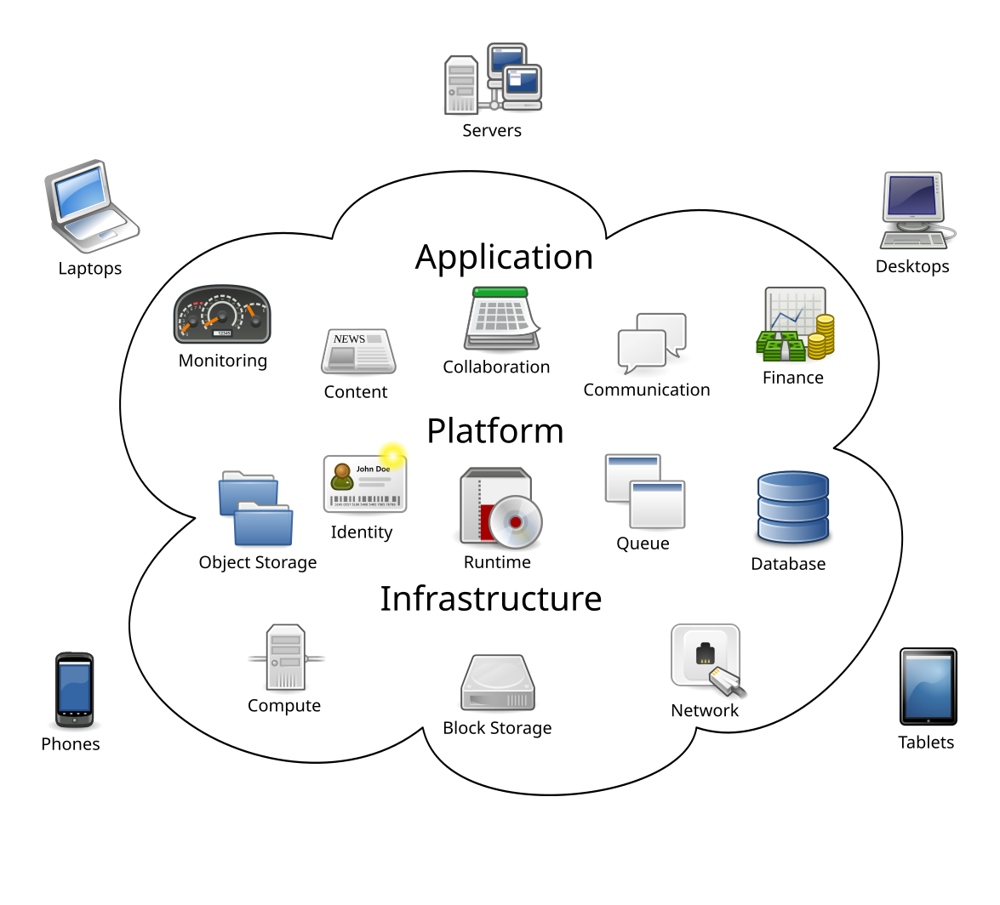
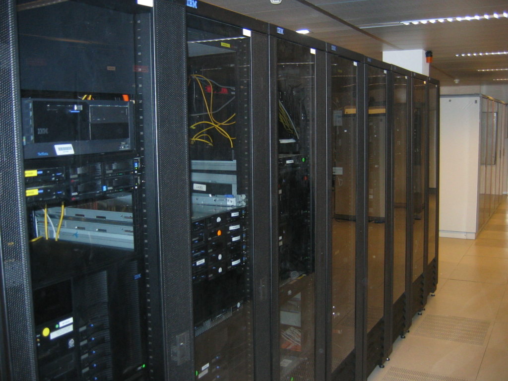

# Cloud Computing Research

## What is Cloud Computing?

Cloud computing is the delivery of computing services over the internet rather than running everything on local computers or on-premises servers.

These services include:

* Computing power, such as virtual machines
* Data storage
* Databases
* Networking
* Artificial Intelligence services
* Analytics tools
* Software applications

Instead of purchasing and maintaining physical infrastructure, businesses can rent resources from cloud providers and pay only for what they use.

## Traditional IT vs Cloud Computing

| Traditional IT               | Cloud Computing                                |
| ---------------------------- | ---------------------------------------------- |
| Buy physical servers         | Rent computing resources                       |
| Large upfront cost           | Pay-as-you-go pricing                          |
| Maintain hardware internally | Provider maintains the physical infrastructure |
| Limited scalability          | Scale resources up or down quickly             |
| Long deployment times        | Deploy services in minutes                     |

### Example

A company running its website on a server in its own office is using traditional infrastructure.

The same website running on Amazon Web Services, Microsoft Azure, or Google Cloud Platform is running in the cloud.

---

## Cloud Computing Illustration

*Source: Wikimedia Commons*

---

## What are Data Centres?

A **data centre** is a physical facility containing large numbers of servers, networking equipment, storage devices, power systems, cooling systems, and security controls.

Cloud providers build and operate large data centres around the world. These data centres are the physical foundation of cloud computing.

Data centres are used to:

* Store data
* Run applications
* Provide cloud services
* Support millions of users at the same time
* Provide redundancy and high availability
* Keep services running even if individual systems fail

## Typical Data Centre Components

* Server racks
* Network switches
* Fibre optic cabling
* Backup generators
* Battery systems
* Cooling systems
* Fire suppression systems
* Physical security controls

---

## Example Data Centre

*Source: Wikimedia Commons*

---

## Real Data Centre Walkthrough Video

A useful walkthrough of a real-world data centre is:

[Google Data Center Tour](https://www.youtube.com/watch?v=XZmGGAbHqa0)

This video demonstrates:

* Server racks
* Cooling systems
* Network infrastructure
* Physical security
* Data centre operations

---

## How Do You Know if Something is Running in the Cloud?

There are several indicators that a service is running in the cloud.

### 1. It is accessible through the internet

Examples include:

* Gmail
* Google Drive
* Dropbox
* Salesforce
* Microsoft 365

These services are not installed fully on a local machine. Users access them through a browser, mobile app, or internet-connected application.

### 2. No local server is required

If users can access a system without the organisation owning or maintaining a local server, the service may be cloud-based.

Common access methods include:

* Web browser
* Mobile application
* API
* Desktop application connected to an online service

### 3. It can scale quickly

Cloud systems can often increase or decrease resources depending on demand.

For example, an online shop may need more computing power during a major sale. In the cloud, extra resources can be added quickly without buying new physical servers.

### 4. It is hosted by a cloud provider

Applications may be hosted on platforms such as:

* Amazon Web Services
* Microsoft Azure
* Google Cloud Platform

### Example

Netflix streams content globally using cloud infrastructure. This allows users in different countries to access the service without Netflix needing to place servers in every customer’s home or office.

---

## What are the Main 2 Cloud Deployment Models?

The two main cloud deployment models are:

1. Public Cloud
2. Private Cloud

---

## 1. Public Cloud

A **public cloud** is cloud infrastructure owned and operated by a third-party provider. Organisations rent access to services rather than owning the infrastructure themselves.

Examples include:

* Amazon Web Services
* Microsoft Azure
* Google Cloud Platform

### Characteristics

* Shared infrastructure
* Highly scalable
* Lower upfront cost
* Fast deployment
* Managed by the cloud provider

### Example

A startup hosting its website and database on AWS is using the public cloud.

---

## 2. Private Cloud

A **private cloud** is cloud infrastructure dedicated to one organisation. It may be hosted in the organisation’s own data centre or managed by a third-party provider.

### Characteristics

* Dedicated infrastructure
* Greater control
* Higher security customisation
* Higher cost
* More responsibility for maintenance and governance

### Example

A bank may use a private cloud for sensitive financial systems where strict control, security, and compliance are required.

---

## What are the 2 More Complex Cloud Deployment Models?

The two more complex cloud deployment models are:

1. Hybrid Cloud
2. Multi-Cloud

---

## 1. Hybrid Cloud

A **hybrid cloud** combines public cloud and private cloud environments.

Some workloads remain in a private environment, while others run in the public cloud.

### Example

A hospital may keep sensitive patient records in a private environment but use Azure or AWS for analytics, reporting, or machine learning.

### Benefits

* Flexibility
* Improved control over sensitive data
* Ability to modernise gradually
* Useful for organisations with legacy systems

---

## 2. Multi-Cloud

A **multi-cloud** strategy means using more than one cloud provider.

### Example

A company may use:

* AWS for storage
* Azure for Microsoft-based enterprise systems
* Google Cloud for AI and analytics workloads

### Benefits

* Reduced vendor lock-in
* Increased resilience
* Ability to choose the best service from each provider
* More flexibility across regions and workloads

---

## What are the Three Main Types of Cloud Services?

The three main types of cloud services are:

1. Infrastructure as a Service
2. Platform as a Service
3. Software as a Service

These are often shortened to:

* IaaS
* PaaS
* SaaS

---

## 1. Infrastructure as a Service

**Infrastructure as a Service** provides basic computing infrastructure over the internet.

This includes:

* Virtual machines
* Storage
* Networking
* Firewalls
* Load balancers

### Examples

* Amazon EC2
* Azure Virtual Machines
* Google Compute Engine

### User Responsibilities

The user usually manages:

* Operating system
* Applications
* Data
* Security configuration
* Runtime environment

### Provider Responsibilities

The cloud provider manages:

* Physical servers
* Data centres
* Networking hardware
* Storage hardware

### Example

A company rents a virtual machine from AWS and installs its own application on it.

---

## 2. Platform as a Service

**Platform as a Service** provides a managed platform for developing, testing, deploying, and running applications.

The user focuses mainly on the application code, while the provider manages the underlying infrastructure.

### Examples

* Azure App Service
* Google App Engine
* AWS Elastic Beanstalk

### User Responsibilities

The user usually manages:

* Application code
* Data
* Application configuration

### Provider Responsibilities

The provider manages:

* Servers
* Operating systems
* Runtime environment
* Scaling
* Infrastructure maintenance

### Example

A developer deploys a web application to Azure App Service without managing the operating system or server hardware.

---

## 3. Software as a Service

**Software as a Service** provides complete software applications over the internet.

Users do not manage the infrastructure, platform, or application code. They simply use the software.

### Examples

* Microsoft 365
* Salesforce
* Dropbox
* Google Workspace

### Example

A business using Microsoft 365 for email, documents, and collaboration is using SaaS.

---

## Advantages of Cloud Computing for a Business

## Cost Reduction

Cloud computing reduces the need to buy and maintain expensive physical hardware.

Businesses can avoid large upfront investment and move towards operational spending.

### Example

Instead of buying servers for £50,000, a company can rent cloud infrastructure and pay monthly based on usage.

---

## Scalability

Cloud services can be scaled up or down quickly.

This is useful when demand changes.

### Example

An e-commerce company can increase computing resources during Black Friday and reduce them afterwards.

---

## Global Reach

Cloud providers operate data centres in many regions around the world.

This allows businesses to deploy applications closer to their users.

### Example

A UK company with customers in Europe and the United States can host services in multiple regions to improve performance.

---

## Faster Deployment

Cloud resources can often be created in minutes.

This speeds up development, testing, and product launches.

---

## Reliability

Cloud providers offer features such as:

* Backup
* Replication
* Disaster recovery
* Multiple availability zones
* Monitoring

These features help keep services available.

---

## Security

Large cloud providers invest heavily in cybersecurity.

They provide tools for:

* Identity management
* Encryption
* Monitoring
* Threat detection
* Access control

However, customers are still responsible for configuring cloud services securely.

---

## Innovation

Cloud platforms provide access to advanced technologies without requiring businesses to build everything themselves.

Examples include:

* Artificial Intelligence
* Machine Learning
* Big data analytics
* Internet of Things
* Serverless computing

---

## Potential Disadvantages or Pitfalls for a Business

## Vendor Lock-In

Vendor lock-in happens when a business becomes heavily dependent on one cloud provider.

Moving to another provider can become difficult, expensive, or time-consuming.

### Example

A company using many AWS-specific services may find it difficult to move the same system to Azure or Google Cloud.

---

## Cost Management Problems

Cloud can become expensive if resources are not managed carefully.

Common causes include:

* Leaving unused virtual machines running
* Storing unnecessary data
* Poor monitoring
* Unexpected data transfer charges
* Over-provisioning resources

### Example

A development team may create test servers and forget to shut them down, causing unnecessary monthly costs.

---

## Internet Dependency

Cloud services require reliable internet access.

If an organisation loses internet connectivity, users may not be able to access cloud applications.

---

## Data Sovereignty and Compliance

Some industries have strict rules about where data can be stored and processed.

This is especially important in sectors such as:

* Healthcare
* Finance
* Government
* Legal services

### Example

A healthcare organisation may need to ensure that patient data is stored in an approved region.

---

## Security Misconfiguration

Cloud providers secure the underlying infrastructure, but customers are responsible for how they configure their services.

Common risks include:

* Publicly exposed storage buckets
* Weak access controls
* Poor password and identity management
* Lack of encryption
* Excessive user permissions

---

## Service Outages

Major cloud providers are reliable, but outages can still happen.

A business should plan for resilience, backups, and disaster recovery.

---

## Cloud Market Share in 2026

The cloud infrastructure market is dominated by three major providers:

* Amazon Web Services
* Microsoft Azure
* Google Cloud Platform

These are often referred to as the **Big Three** cloud providers.

## Approximate Global Cloud Infrastructure Market Share, 2026

| Provider        | Approximate Global Market Share |
| --------------- | ------------------------------: |
| AWS             |                          28-31% |
| Microsoft Azure |                          21-25% |
| Google Cloud    |                          13-14% |
| Others          |                          30-38% |

AWS remains the largest cloud provider. Microsoft Azure is second and is especially strong in enterprise environments. Google Cloud is third and is particularly strong in data analytics, AI, and machine learning.

Together, the Big Three account for a large majority of global cloud infrastructure spending.

---

## What are the Big Three Cloud Providers Known For?

## Amazon Web Services

Amazon Web Services, usually called **AWS**, is the largest and most mature cloud provider.

### Known For

* Largest cloud market share
* Broadest range of cloud services
* Mature ecosystem
* Global infrastructure
* Strong developer community

### Key Strengths and USPs

* More than 200 cloud services
* Strong compute, storage, database, and networking options
* Mature documentation and learning resources
* Strong adoption among startups, enterprises, and technology companies
* Large marketplace and partner ecosystem

### Common AWS Services

* Amazon EC2
* Amazon S3
* Amazon RDS
* Amazon Redshift
* AWS Lambda
* AWS Glue
* Amazon DynamoDB

### Example

A data team may use Amazon S3 for storing raw data, AWS Glue for data processing, and Amazon Redshift for analytics.

---

## Microsoft Azure

Microsoft Azure is the second-largest cloud provider and is especially strong in enterprise and corporate environments.

### Known For

* Enterprise adoption
* Strong integration with Microsoft products
* Hybrid cloud capabilities
* Windows Server and Active Directory integration

### Key Strengths and USPs

* Integrates well with Microsoft 365
* Strong fit for organisations already using Microsoft technologies
* Strong hybrid cloud tools
* Popular with large enterprises, public sector organisations, and regulated industries
* Strong data and analytics tools

### Common Azure Services

* Azure Virtual Machines
* Azure SQL Database
* Azure Synapse Analytics
* Azure Data Factory
* Azure Cosmos DB
* Azure Blob Storage
* Microsoft Fabric
* Azure Machine Learning

### Example

A business already using Microsoft 365 and Power BI may choose Azure because it integrates naturally with its existing systems.

---

## Google Cloud Platform

Google Cloud Platform, usually called **GCP**, is known for data analytics, machine learning, and cloud-native technologies.

### Known For

* Data analytics
* Artificial Intelligence
* Machine Learning
* Kubernetes and container technology
* Strong engineering infrastructure

### Key Strengths and USPs

* BigQuery is a leading cloud data warehouse
* Strong AI and machine learning services
* Strong container and Kubernetes heritage
* Good fit for analytics-heavy and AI-focused workloads
* Strong data engineering capabilities

### Common Google Cloud Services

* BigQuery
* Cloud Storage
* Cloud SQL
* Bigtable
* Dataflow
* Dataproc
* Vertex AI
* Google Kubernetes Engine

### Example

A data team may use BigQuery to analyse large datasets quickly and Vertex AI to build machine learning models.

---

## What Do You Usually Pay For When Using the Cloud?

Cloud pricing is usually based on usage. This is often called a **pay-as-you-go** model.

Businesses usually pay for the following categories.

## Compute

Compute means processing power.

Examples include:

* Virtual machines
* Containers
* Serverless functions

### Cloud Examples

* AWS EC2
* Azure Virtual Machines
* Google Compute Engine
* AWS Lambda
* Azure Functions
* Google Cloud Functions

---

## Storage

Storage refers to data stored in the cloud.

Examples include:

* Files
* Images
* Videos
* Backups
* Logs
* Raw data
* Processed datasets

### Cloud Examples

* Amazon S3
* Azure Blob Storage
* Google Cloud Storage

---

## Networking

Networking costs may include:

* Data transfer between regions
* Data leaving the cloud provider
* Load balancing
* Virtual networks
* Content delivery networks

Data transfer out of the cloud can be a major cost.

---

## Databases

Managed databases are usually charged based on:

* Storage used
* Compute used
* Number of reads and writes
* Backup usage
* Availability requirements

### Cloud Examples

* Amazon RDS
* Azure SQL Database
* Google Cloud SQL
* Amazon DynamoDB
* Azure Cosmos DB

---

## AI and Analytics Services

Cloud providers charge for advanced services such as:

* Machine learning model training
* Model deployment
* Data warehouse queries
* ETL pipelines
* Large-scale data processing

### Example

BigQuery may charge based on the amount of data processed by queries.

---

## Monitoring and Security Services

Businesses may also pay for:

* Logging
* Monitoring
* Alerts
* Security scanning
* Threat detection
* Identity management features

---

## Examples of Cloud Data Services

## AWS Data Services

| Service           | Purpose                                            |
| ----------------- | -------------------------------------------------- |
| Amazon S3         | Object storage for files, raw data, and data lakes |
| Amazon Redshift   | Cloud data warehouse                               |
| Amazon RDS        | Managed relational databases                       |
| Amazon DynamoDB   | NoSQL database                                     |
| AWS Glue          | Data integration and ETL                           |
| Amazon Athena     | Query data in S3 using SQL                         |
| Amazon QuickSight | Business intelligence and dashboards               |

---

## Azure Data Services

| Service                 | Purpose                             |
| ----------------------- | ----------------------------------- |
| Azure Blob Storage      | Object storage                      |
| Azure Data Lake Storage | Storage for data lakes              |
| Azure SQL Database      | Managed relational database         |
| Azure Synapse Analytics | Analytics and data warehousing      |
| Azure Data Factory      | Data integration and ETL            |
| Azure Cosmos DB         | Globally distributed NoSQL database |
| Microsoft Fabric        | End-to-end analytics platform       |
| Power BI                | Business intelligence and reporting |

---

## Google Cloud Data Services

| Service       | Purpose                             |
| ------------- | ----------------------------------- |
| BigQuery      | Serverless cloud data warehouse     |
| Cloud SQL     | Managed relational database         |
| Cloud Storage | Object storage                      |
| Bigtable      | Large-scale NoSQL database          |
| Dataflow      | Stream and batch data processing    |
| Dataproc      | Managed Spark and Hadoop            |
| Pub/Sub       | Messaging and event streaming       |
| Looker        | Business intelligence and analytics |

---

## Cloud Certifications for Data Professionals

Cloud certifications can help data analysts, data engineers, and aspiring data scientists demonstrate cloud knowledge.

The best certification depends on the target role and preferred cloud provider.

---

## AWS Certifications

### AWS Certified Cloud Practitioner

This is an entry-level certification.

It is useful for learning:

* Basic cloud concepts
* AWS services
* Cloud pricing
* Security basics
* Shared responsibility model

This is suitable for beginners who want a general understanding of cloud computing.

---

### AWS Certified Data Engineer - Associate

This certification is more relevant for data professionals.

It focuses on:

* Data ingestion
* Data transformation
* Data pipelines
* Data lakes
* Data storage
* Data analytics services

This is useful for people targeting data engineering or cloud data roles.

---

## Microsoft Azure Certifications

### Azure Fundamentals - AZ-900

This is an entry-level Azure certification.

It covers:

* Cloud concepts
* Azure services
* Azure pricing
* Governance
* Security
* Compliance

This is a good starting point for people new to cloud computing.

---

### Azure Data Fundamentals - DP-900

This certification is specifically relevant to data professionals.

It covers:

* Relational data
* Non-relational data
* Analytics workloads
* Azure data services
* Basic data engineering concepts

This is a strong first certification for a data analyst or aspiring data engineer.

---

### Azure Data Engineer Associate - DP-203

This certification is more advanced.

It focuses on:

* Designing data storage
* Building data processing pipelines
* Securing data platforms
* Monitoring data solutions
* Working with Azure Data Factory, Synapse, and Data Lake tools

This is useful for data engineering roles.

---

## Google Cloud Certifications

### Google Cloud Digital Leader

This is an entry-level certification.

It is useful for understanding:

* Cloud concepts
* Google Cloud products
* Digital transformation
* Business use cases

---

### Google Professional Data Engineer

This is a more advanced and respected certification for data professionals.

It focuses on:

* Data processing systems
* Machine learning models
* Data pipelines
* Data reliability
* Security
* Analytics solutions

This is useful for data engineers, analytics engineers, and data professionals working with Google Cloud.

---

## Recommended Certification Path for Data Analysts and Aspiring Data Scientists

A practical certification path could be:

### Step 1: Start with a cloud fundamentals certification

Choose one:

* Azure Fundamentals - AZ-900
* AWS Certified Cloud Practitioner
* Google Cloud Digital Leader

### Step 2: Add a data-focused fundamentals certification

A strong option is:

* Azure Data Fundamentals - DP-900

This is especially useful for data analysts because it introduces relational data, non-relational data, analytics workloads, and cloud data services.

### Step 3: Choose a specialist route

## Data Engineering Route

Suitable certifications include:

* Azure Data Engineer Associate - DP-203
* AWS Certified Data Engineer - Associate
* Google Professional Data Engineer

## Data Science and AI Route

Suitable certifications include:

* Azure AI Engineer Associate
* AWS Machine Learning Engineer
* Google Professional Machine Learning Engineer

---

## Suggested Route for a Data Professional

For someone building a career in data analytics, data engineering, or data science, a sensible route is:

1. Azure Fundamentals - AZ-900
2. Azure Data Fundamentals - DP-900
3. Azure Data Engineer Associate - DP-203

This route is particularly practical because Azure is widely used in enterprise, public sector, healthcare, and Microsoft-based organisations.

---

## Key Takeaways

* Cloud computing delivers IT resources over the internet.
* Data centres are the physical facilities that power cloud computing.
* Public Cloud and Private Cloud are the two main deployment models.
* Hybrid Cloud and Multi-Cloud are more advanced deployment models.
* IaaS, PaaS, and SaaS are the three main cloud service models.
* AWS, Azure, and Google Cloud dominate the cloud infrastructure market.
* AWS is known for scale, maturity, and breadth of services.
* Azure is known for enterprise adoption and Microsoft integration.
* Google Cloud is known for data analytics, AI, and machine learning.
* Cloud pricing is usually based on usage.
* Businesses usually pay for compute, storage, networking, databases, analytics, monitoring, and security services.
* Cloud computing offers scalability, flexibility, speed, and innovation.
* Cloud computing also creates risks such as cost overruns, vendor lock-in, security misconfiguration, and compliance challenges.
* Data professionals benefit from learning cloud platforms because modern data work often depends on cloud storage, databases, pipelines, analytics, and AI services.

---

## References

* [Amazon Web Services](https://aws.amazon.com)
* [Microsoft Azure](https://azure.microsoft.com)
* [Google Cloud](https://cloud.google.com)
* [Google Data Center Tour - YouTube](https://www.youtube.com/watch?v=XZmGGAbHqa0)
* Synergy Research Group Cloud Market Reports
* CRN Cloud Market Share Reports
* Wikimedia Commons image sources
